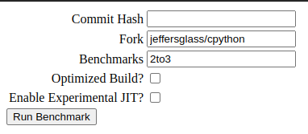

# Snakeden - Distributed pypeformance runs

## Usage

### Installation

1. Clone this repo
2. Run `make setup`
3. (Optionally) activate the virtual environment with `source ./venv/bin/activate`

### Running a Dev Server
Run `make debug` to run the local dev server in the browser. Go to the root url (`/`) to view the interactive interface.
